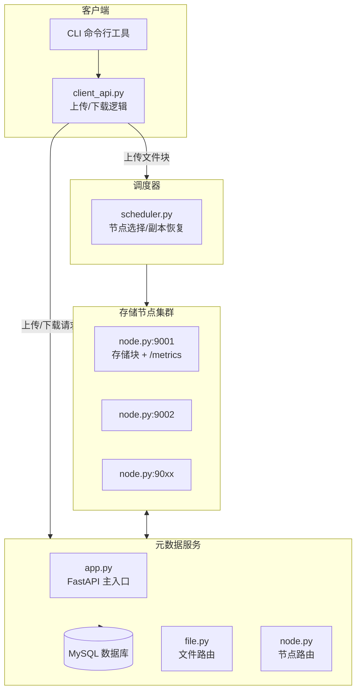

# 🌐 Distributed File Storage System


**DistributedFileSystem** 是一个基于 **Python + FastAPI + MySQL** 构建的轻量级分布式文件存储系统。  
项目模拟了主流分布式存储系统（如 HDFS、Ceph）的核心功能，重点在于数据的切块存储、多副本容错、动态调度和节点管理。  

该系统以学习和实践为目标，逐步实现了从「文件切块上传」到「副本恢复与负载均衡」的演进过程，  
帮助开发者理解分布式存储系统在可靠性、可扩展性和高可用性方面的设计思路。

---

## ✨ 核心功能

- **文件切块与元数据管理**  
  - 将大文件切分为多个块（chunk），并存储其元数据（文件名、大小、存储位置等）。  

- **存储节点服务**  
  - 每个节点独立运行，负责块的存储和读取。  
  - 节点启动时自动向元数据服务注册。  

- **多副本存储**  
  - 上传文件时可指定副本数，系统将文件块分布到多个节点，提升可靠性。  

- **下载与合并**  
  - 客户端可从多个节点并行下载块，并合并恢复原始文件。  

- **文件删除**  
  - 支持文件级删除，自动清理数据库记录和存储节点数据。  

- **节点管理**  
  - 节点支持自动注册与下线检测，保证数据库中只保留活跃节点。  

- **副本恢复机制**  
  - 当副本数不足时，系统能自动补齐缺失副本，保证数据冗余度。  

- **负载均衡策略**  
  - 调度器支持多种策略（轮询 / 随机 / 最少使用），实现灵活调度。  

- **监控接口**  
  - 节点提供 `/metrics` 接口，返回存储块数量与空间占用情况。  

---

## 🚀 为什么做这个项目？

分布式文件存储是云计算和大数据系统的核心组件。  
通过本项目，你可以学习和掌握：  

- 如何将文件分片并存储到多个节点；  
- 如何通过副本机制实现 **高可用与容错**；  
- 如何设计元数据服务来管理全局状态；  
- 如何进行 **负载均衡** 和 **动态节点管理**；  
- 如何扩展系统功能（恢复、监控、多用户…）。  

这使得项目不仅仅是一个 Demo，而是一个 **可持续迭代的分布式系统雏形**，可以作为学习资料、课程设计或简历项目。  

---
部署流程

- pip install -r requirements.txt #安装依赖

- docker-compose up -d #将docker-compose.yml在docker中进行部署容器的操作

- 或者直接拉取 MySQL 镜像并运行容器
docker run -d \
  --name dfs-mysql \
  -e MYSQL_ROOT_PASSWORD=123456 \
  -e MYSQL_DATABASE=test0 \
  -p 3306:3306 \
  mysql:8.0

docker exec -it dfs-mysql \
  mysql -uroot -p123456 test0 < docs/schema.sql  #创建项目所需表


- uvicorn metadata_server.app:app --reload #启动本地服务节点

- python3 -m storage_nodes.node 9001 #(默认是启动9001端口，其他端口同理)

- python3 -m storage_nodes.node 9002 #启动多个存储节点（按需执行）

‘’‘

- python3 -m client.cli upload tests/test.txt #上传test.txt文件,不同的chunk都会保存在./data文件夹下

- python3 -m client.cli download 1 tests/storage_data/download_data.txt  #get属于file_id = 1 的chunk部分并合并为一个txt文件

- python3 -m client.cli delete 1 #删除file_id 为1的文件，并在数据库中删除其file和chunks


- python3 -m tests.recover_test #副本恢复（测试用）


## 功能特性

- ✅ Week 1: 文件切块，元数据存储
- ✅ Week 2: 存储节点服务，自动注册，调度器动态获取节点
- ✅ Week 3: 健康检查，多副本存储，容错下载
- ✅ Week 4: 可配置副本数，文件删除，节点下线检测
- ✅ Week 5: 副本恢复，负载均衡策略，节点监控接口
- 🔄 Week 6: 计划实现并行上传下载、性能测试 ...


## 🛠️ 技术栈

## 🛠 技术栈

| 分类       | 技术栈                                   
|------------|--------------------------------------
| **语言**   | Python 3.9+                              
| **框架**   | FastAPI                                  
| **数据库** | MySQL · SQLAlchemy                       
| **通信**   | RESTful API (HTTP)                       
| **调度**   | 自定义 Scheduler（轮询 / 随机 / 最少使用）
| **存储**   | 本地文件系统 (`./data`)                   
| **容错**   | 多副本存储 · 副本恢复机制                
| **监控**   | 节点 `/metrics` 接口                     
| **运行**   | Uvicorn                                  
| **测试**   | Pytest                                   
| **文档**   | Markdown · Draw.io / Mermaid             


---

## 📁 项目结构说明

```bash
DistributedFileSystem/
├── client/               # 客户端：切块上传、下载、命令行接口
├── metadata_server/      # FastAPI 服务：文件元信息、节点注册
├── storage_nodes/        # 模拟存储节点（支持动态添加）
├── controller/           # 调度器：块副本分配与恢复
├── common/               # 工具方法（hash、切块、配置）
├── tests/                # 单元测试、接口测试
├── docs/                 # 架构图、接口文档、设计说明
├── docker-compose.yml    # 一键部署多个组件
├── requirements.txt      # Python 依赖
├── README.md             # 项目说明
└── .env                  # 环境变量（MySQL 配置等）

DistributedFileSystem/
├── client/                           # 客户端上传文件的模块
│   ├── cli.py                        # 客户端命令行入口
│   └── client_api.py                # 客户端逻辑：切块、上传、与元数据服务交互
│
├── metadata_server/                 # 元数据服务
│   ├── app.py                        # FastAPI 主程序入口
│   ├── db.py                         # 数据库连接（SQLAlchemy）
│   ├── models.py                     # ORM 模型
│   └── routes/                       # 路由模块
│       ├── __init__.py
│       ├── file.py                  # 文件相关路由：注册文件、查询元数据
│       └── node.py                  # 存储节点注册、心跳等
│
├── storage_nodes/                   # 存储节点模拟服务
│   ├── node.py                      # FastAPI 接收文件块
│   └── data/                        # 模拟存储位置（块文件会保存在这里）
│
├── common/                          # 公共代码模块
│   └── utils.py                     # 工具函数，如文件校验和、时间戳等
│
├── controller/                      # 计划中的调度模块
│   └── scheduler.py                 # 节点调度、负载均衡逻辑
│
├── tests/                           # 测试模块
│   └── storage_data/                # 测试下载文件存储
│   ├    └── downlaod_data.txt       # 下载文件存储文件
│   └── recover_test.py              # 副本恢复测试文件
│   └── test.txt                     # 上传测试文件
│
├── docs/                            # 文档与设计
│   ├── schema.sql                   # MySQL 表结构定义
│   ├── week5_summary.md             # 第 5 周总结文档
│   ├── week4_summary.md             # 第 4 周总结文档
│   ├── week3_summary.md             # 第 3 周总结文档
│   ├── week2_summary.md             # 第 2 周总结文档
│   ├── week1_summary.md             # 第 1 周总结文档
│   └── architecture.drawio          # 架构图
│
├── requirements.txt                 # Python 依赖包列表
├── README.md                        # 项目说明文件
└── .gitignore                       # 忽略文件配置


```


---
##   📐 项目架构图

